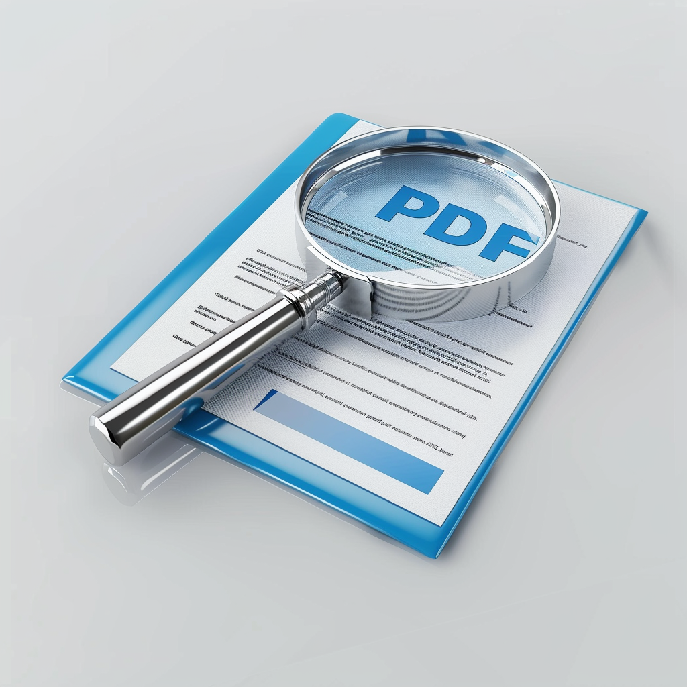
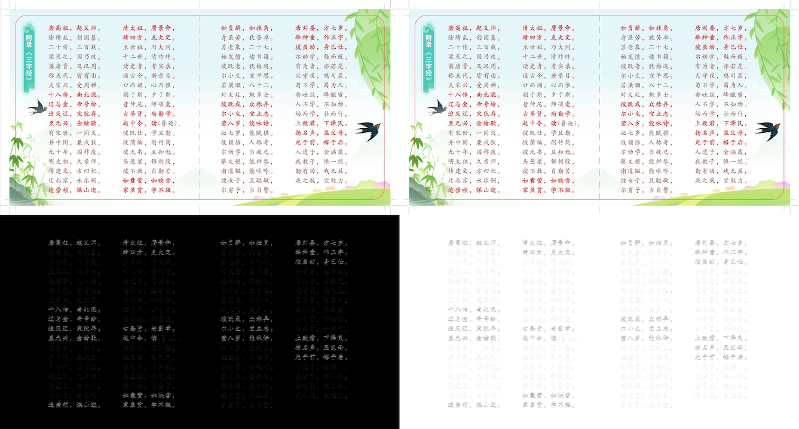
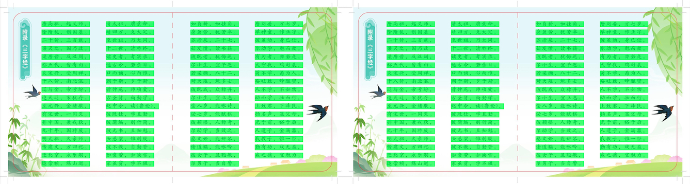

<p align="center">
  
</p>

<p align="center">
    【English | <a href="../doc/README-Chinese.md">Chinese</a> | <a href="../doc/README-Japanese.md">Japanese</a>】
</p>

## 📖 Overview

<p align="center">
  
</p>

## ❓ What Can PDF Comparator Do?

1. Image Difference Comparison

<p align="center">
  
</p>

2. Text Difference Comparison

<p align="center">
  
</p>

### 🖥️ Quick Start

Please follow the steps below:

1. **Clone the GitHub Repository:** Clone the repository using the following command:

```bash
git clone https://github.com/VintLin/pdf-comparator.git
```

2. **Set up Python Environment:** Open the "pdf-comparator" project directory and ensure you have Python 3.8 or higher. You can create and activate this environment using the following command, replacing "venv" with your preferred environment name:

```bash
cd pdf-comparator
python3 -m venv venv
```

3. **Install Dependencies:** Install the required dependencies by running the following command:

```bash
pip3 install -r requirements.txt
```

4. **Run the Code Directly:** Compare PDF files by running the following command:

```bash
python3 -m pdfcomparator "/compare_file_1.pdf" "/compare_file_2.pdf" "/result_folder/" --image --text
```

5. **Build an Executable:** You can also build an executable using cx-Freeze as needed (the executable can be found in "/build/" after a successful build):

```bash
python3 setup.py build
```

6. **Run the Executable:** Compare PDF files by running the following command with the executable:

```bash
./pdfcomparator.exe "/compare_file_1.pdf" "/compare_file_2.pdf" "/result_folder/" --image --text
```

### Command Line Argument Usage

This program accepts the following command line arguments:

- `file1` (required): Path to input file 1. Please provide the path to the first file you want to compare.

- `file2` (required): Path to input file 2. Please provide the path to the second file you want to compare.

- `output_folder` (required): Path to the output folder. Comparison results will be saved in this folder.

- `--image`: Optional argument. If specified, the program will perform image comparison. This option is enabled by default.

- `--text`: Optional argument. If specified, the program will perform text comparison. This option is disabled by default.

- `--cache` or `-c`: Optional argument for specifying a cache path. If a cache path is specified, the program will use caching to accelerate the comparison process. Caching is not enabled by default.

### Examples

Here are some usage examples:

```bash
# Perform image comparison
python3 -m pdfcomparator file1.pdf file2.pdf output_folder/ --image

# Perform text comparison
python3 -m pdfcomparator file1.pdf file2.pdf output_folder/ --text

# Perform image comparison and enable caching
python3 -m pdfcomparator file1.pdf file2.pdf output_folder/ --image --cache /path/to/cache
```

## 👨‍💻‍ Contributors

<a href="https://github.com/VintLin/pdf-comparator/contributors">
  
</a>

Made with [contrib.rocks](https://contrib.rocks).

## ⚖️ License

- Source Code Licensing: Our project's source code is licensed under the MIT License. This license permits the use, modification, and distribution of the code, subject to certain conditions outlined in the MIT License.
- Project Open-Source Status: The project is indeed open-source; however, this designation is primarily intended for non-commercial purposes. While we encourage collaboration and contributions from the community for research and non-commercial applications, it is important to note that any utilization of the project's components for commercial purposes necessitates separate licensing agreements.

## 🌟 Star History

[](https://star-history.com/#VintLin/pdf-comparator&Date)

## 📬 Contact

If you have any questions, feedback, or would like to get in touch, please feel free to reach out to us via email at [vintonlin@gmail.com](mailto:vintonlin@gmail.com)
